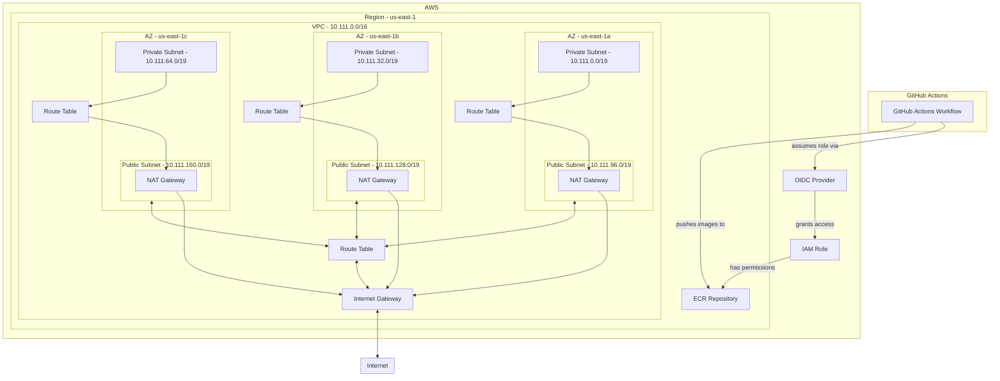

### Description

### Tech Stack:
* **Docker** [ ]
* **AWS:**
  * IAM  [ ]
    * Identity Provider (oidc) [ ]
  * EKS [ ]
  * VPC [ ]
  * Subnet [ ]
  * Internet Gateway [ ]
  * RDS [ ]
  * ECR [ ]
  * ALB [ ]
* **CI/CD:**
  * GitHub Actions [ ]

Todos

### Todos:
* **SetUp development environment:** [X]
    * Branch: feature/setup-development-environment
    * PR: https://github.com/franciscoprin/parrot-project/pull/6/files
    * Consider using the Cloudposse Geodesic container for easier development. [X]
        * [Cloudposse Geodesic container](https://github.com/cloudposse/geodesic)
    * Install inside of the geodesic container some necesary software. [ ]
        * OpenTofu to avoid dealing with the proprietary HashiCorp license change. [X]
            * [OpenTofu Installation Guide](https://opentofu.org/docs/intro/install/alpine/)
            * Already installed by default
        * Atmos to be able to create applications by just creating yaml blocks. [X]
            * [Atmos Installation Guide](https://atmos.tools/install/)
    * Set up Cloudposse Atmos inside the `infrastructure` folder. [X]
      * [Atmos tutorial]

* **Setting OIDC for GitHub**:
  * Configure the 
  * Create the resources inside of `github-oidc-provider` [ ]
  * Use the file inside of [github-assume-role-policy.mixin.tf](https://github.com/cloudposse/terraform-aws-components/blob/d12201d0affeffd14e5d47276934cfd4b91c2d15/modules/account-map/modules/team-assume-role-policy/github-assume-role-policy.mixin.tf) to import and create the oidc configurations and grant the ECR role with the necesary permissions to push images to ECR.
  * Create the resources inside of ecr component.
  * Test your changes with the `challenge-devops-build.yml` pipeline.

* **Create the infrastructure for the application.** [ ]
  * (Some of the Terraform code and diagrams were created in one of your repositories) [ ]
  * VPC Atmos Component [ ]
    * VPC Atmos Component [ ]
        * Create subnets: [ ]
            * Private Subnet: [ ]
                * For database [ ]
                * For EKS nodes where the application will live [ ]
            * Public Subnet: [ ]
                * For the ALB that will expose the application to the internet [ ]
            * Create an internet gateway and attach it to the public subnet using route tables. [ ]
  * EKS Atmos Component [ ]
    * EKS Cluster [ ]
    * Node Groups [ ]
  * parrot-app Atmos Component [ ]
    * Create RDS database: [ ]
      * Set those secrets in SSM [ ]
    * Create an IAM role that allows the pod to CRUD the RDS database [ ]
  * GitHub OIDC Provicer [X]
    * To grant GitHub Actions permission to push images to ECR
    * Branch: feature/setup-github-oidc-provider
    * PR: https://github.com/franciscoprin/parrot-project/pull/4
  * ECR Atmos component [ ]
    * **TODO:** for some reason old images are not beind deleted (REF: var.max_image_count)
    * To host the images for the application.
    * Branch: feature/setup-ecr
    * PR: https://github.com/franciscoprin/parrot-project/pull/5
  * Datadog Atmos Component: [ ]
    * Install Datadog Agent inside all the node groups. [ ]
  * AWS Load Balancer Controller Component: [ ]
    * Enable applications to create ALBs [ ]

* **Create Pipeline for the Application:** [ ]
  * Pull-Request Pipeline [X]
    * (Description: Responsible for running unit tests on each PR commit.)
    * Create pull-request pipeline using docker-compose file [X]
        * Interesting post of using docker-compose to run the tests: 
            * https://stackoverflow.com/questions/64364989/github-actions-how-to-run-test-inside-container
            * Branch: feature/create-pipeline-challenge-devops-pull-request
            * PR: https://github.com/franciscoprin/parrot-project/pull/1
        * Consider not using docker-compose because test could slowdown due to docker-compose file.
  * Build Pipeline [X]
    * Branch: feature/create-pipeline-challenge-devops-build
    * PR: https://github.com/franciscoprin/parrot-project/pull/3
    * Description: Triggered on each new commit to main or when a PR is merged. It builds the container and pushes the image to ECR. [ ]
  * Deploy Pipeline: [ ]
    * Branch: feature/create-pipeline-challenge-devops-deploy
    * PR: ???
    * Description: Runs when creating a release in the repository. Depending on the release level, the application could be deployed to different environments. [ ]

* **Possible Improvements to the Application:** [ ]
  * Use Chamber to retrieve SSM environment variables. [ ]
    * Install Chamber in the Dockerfile. [ ]
    * Create a new entrypoint to read SSM secrets using Chamber. [ ]
  * The Docker entrypoint should not be responsible for checking if the database is running.
    * Branch: feature/docker-entrypoint-skip-db-check
    * PR: https://github.com/franciscoprin/parrot-project/pull/2
    * This approach is problematic in non-local environments (e.g., staging and production), where it's preferable for the application to fail if the database is unavailable rather than remaining idle and repeatedly checking.
    * For local development with Docker Compose, checking the database's availability might make sense since both the application and database are started together, and the database might temporarily be unavailable. However, it’s better to handle this within the Docker Compose configuration rather than modifying the entrypoint, as this logic should not apply to non-production environments.
  * Automatically create a superuser using environment variables: [ ]
    * [Automate Django Createsuperuser](https://stackoverflow.com/questions/6244382/how-to-automate-createsuperuser-on-django) [ ]
  * Ensure health checks can read from the database. [ ]
  * Output application logs in JSON format for better integration with Datadog. [ ]
  * Being able to use buildx to have multy platform builds [ ]
    * [Reference video](https://www.youtube.com/watch?v=9jZTsfby5io)

* **Possible Improvements to the GitHub repository:** [ ]
  * Create default template for PRs [X]
    * Branch: feature/create-default-pull-request-template
    * PR: https://github.com/franciscoprin/parrot-project/pull/7
  * Set branch protection rules, if the challenge-devops-pull-request fails don't allow developers to merge.

* **Possible Improvements for Scalability:** [ ]
  * RDS: [ ]
    * Read Replicas [ ]
  * ElastiCache (Redis): [ ]
    * For caching responses [ ]
  * EKS nodes: [ ]
    * Karpenter [ ]

* **Possible Improvements for Availability:** [ ]
  * RDS: [ ]
    * Multi-AZ deployments for high availability [ ]
  * ReplicaSet (Affinity and Anti-Affinity): [ ]
    * Distribute containers across different nodes in the EKS cluster [ ]

