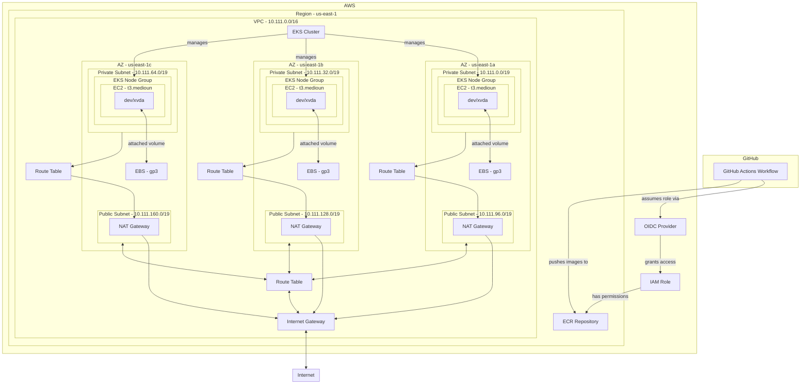

## Description

This repository is a take-home project. It currently has two subfolders for practicality, but in reality, each of these folders should be its own repository.

The `infrastructure` folder contains a monorepo structure that will be responsible for creating the entire architecture (VPC, EKS, etc.) for the applications.



## Getting Started

The Geodesic container is a pre-built Docker image with essential development tools to help you set up quickly. It includes `kubectl`, `aws-cli`, and more. To install it, simply navigate to the `infrastructure` folder and run `make all`. After that, you only need to run `parrot` in your terminal.


### Getting authenticate with AWS
It is recommended to use [Leapp](https://www.leapp.cloud/download/desktop-app) for authenticating with AWS.

### Setting Up Your EKS Context
Configure your Kubernetes context to interact with your Amazon EKS cluster, this could be done inside of the geodesic container:

```bash
aws eks update-kubeconfig --region us-east-1 --name ue1-experiments-eks-cluster --profile experiments-admin
```

### Port-Forwarding an Application

Configure your Kubernetes context to interact with your Amazon EKS cluster. This can be done inside the Geodesic container:

```bash
kubectl port-forward service/challenge-devops-spoton-monochart 8080:default
```

Access the application at [http://localhost:8080](http://localhost:8080).

## Tech Stack:
* **Docker** [ ]
* **CLOUD(AWS):**
  * IAM  [ ]
    * Identity Provider (oidc) [ ]
  * EKS [ ]
  * VPC [ ]
  * Subnet [ ]
  * Internet Gateway [ ]
  * RDS [ ]
  * ECR [ ]
  * ALB [ ]
* **CI/CD:**
  * GitHub Actions [ ]
