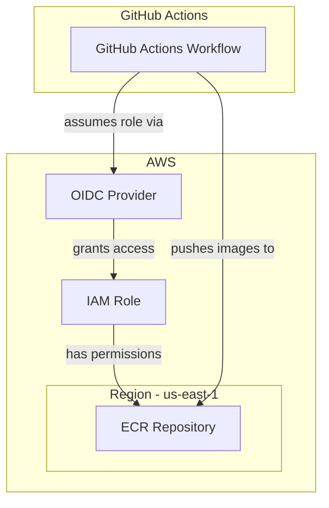

### Description:
This modules creates an OIDC provider which grants access to GitHub actions to assume an IAM role that will have the permissions to push images to ECR's.

### Reference:
* [GitHub OIDC Provider Module by Cloud Posse](https://github.com/cloudposse/terraform-aws-components/tree/1.474.0/modules/github-oidc-provider)
* [YouTube Video: Setting up GitHub OIDC Provider](https://youtube.com/watch?v=aOoRaVuh8Lc)
* [Dev.to Article: AWS SSO and GitHub Setup](https://dev.to/aws-builders/aws-sso-github-setup-35ld)
* [GitHub docs](https://docs.github.com/en/actions/deployment/security-hardening-your-deployments/configuring-openid-connect-in-amazon-web-services)